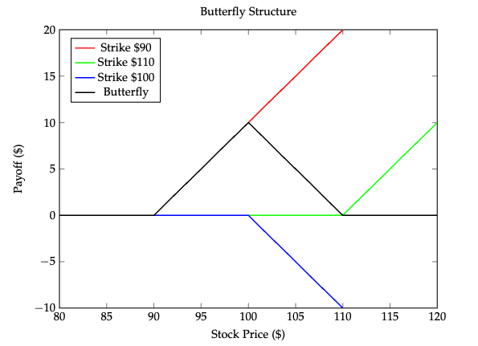
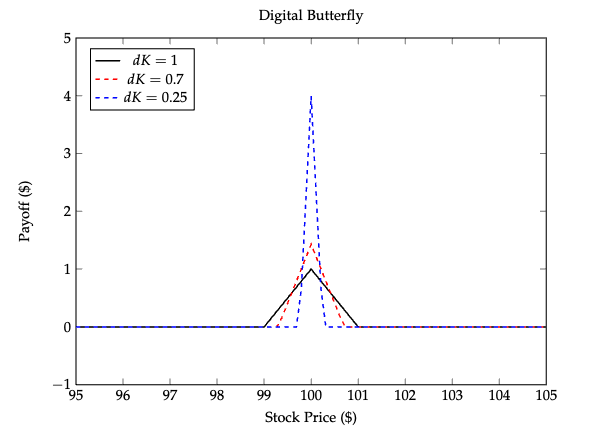
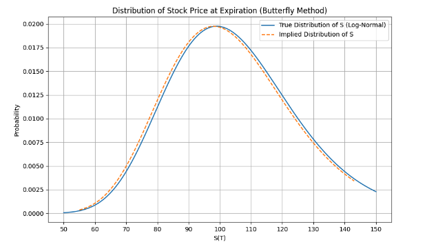
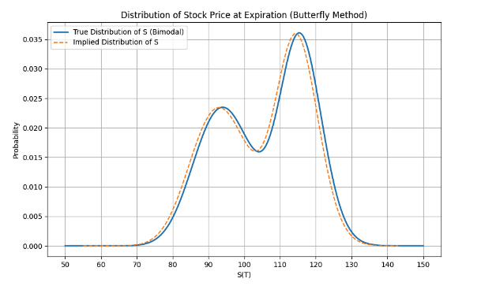
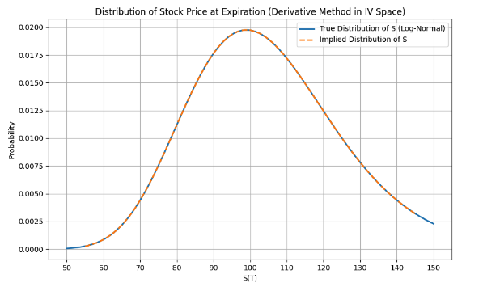
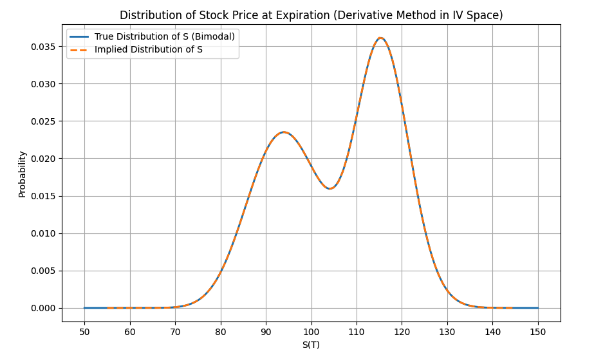

# Introduction
We examine two different methods of deriving the market's risk neutral implied probability density function. We examine the butterfly structure method and the more industry standard Breeden-Litzenberger approach. Each method is tested using call option prices derived firstly through the Black-Scholes framework and secondly using a more unconventional underlying probability distribution of the stock prices. The goal is to offer insight into forward-looking approaches for evaluating assets as an addition to the more traditional backwards-looking ones. This is an important topic to consider as the market can exhibit very different sentiments than that of traditional pricing models and their assumptions. It serves as a reminder not to be over confident in models which can become detached from the market under certain conditions as has been clear from recent history.

## Methodology 
### The European Call Option
The valuation of a European-style call option, which grant the holder the right to purchase an underlying security at a predetermined price and date, can be formulated as the present value of the expected payoff:

$$
C_t = \mathbb{E}[ \max(S_T - K, 0) ] \cdot e^{-r (T-t)}
$$

To compute this value accurately, it is necessary to assume some probability distribution of $S_T$.The log-normal distribution is commonly assumed, facilitating the use of the Black-Scholes-Merton closed-form formula. In essence, to calculate the total value of a call at time $t$, one needs to integrate the probabilities of the stock price maturing at all possible $S_T$ values above the strike, multiplied by the corresponding payoffs, and then discounting to present value. In continuous time, this can be expressed as:

$$
C_t = e^{-r(T-t)} \int_{K}^{\infty} \max(S_T - K, 0) f(S) dS
$$

Here, $f(S)$ denotes the PDF of $S$, which is the central focus of our examination. 

### Option Butterflies
The problem of extracting the implied PDF of stock prices has commonly and successfully been tackled with the construction of so called "option butterflies". Since the payoff of a normal call option is dependent on the extent to which it is in the money, the probability of exercise is linked to the portion of the PDF above the strike price. However, the use of the butterfly structure puts a cap on said upside potential.

The payoff of the butterfly structure is:

$$
Butterfly(K_1, K_2, K_3) = C_T(K_1) - 2\cdot C_T(K_2) + C_T(K_3)
$$

where $C_T(K_i)$ is the payoff of a call with strike $K_i$. The maximum payoff equals half the spread between the first and last strikes. Under the assumption that the payoff is either the maximum or zero, the market price of the structure should equate to the probability of $S_T$ being \$100 multiplied by the maximum payoff. By isolating and calculating this probability for various strikes, we can compile a set of probabilities that, when plotted and interpolated, produce a complete PDF.

The method of constructing option butterflies offers a viable pathway to extract the probability density function of stock prices from publicly available option prices. The following subsection proposes a superior way of achieving this feat.

### Synthetic Digital Butterflies

The method of calculating the "butterfly implied probabilities" is flawed in the sense that the payoff has to be assumed to be binary, even though it is not. It assumes either maximum payoff or nothing at all. To improve the estimation for the probabilities we consider a butterfly spread, i.e. a portfolio of four call options. A long call at strike $K - dK$, two short calls at strike $K$ and a final long call at strike $K + dK$. If the portfolio contains $(1/dK)^2$ units of each call, we can write for the terminal value of the portfolio:

$$
P(S_T, K, dK, T) = \frac{1}{dK^2}\left\{\max(S_T-(K-dK), 0) - 2 \cdot \max(S_T-K, 0) + \max(S_T-(K+dK), 0)\right\}
$$

This portfolio carries the following payoff structure for three different values of $dK$

The terminal payoff becomes narrower and higher the smaller $dK$ is made. In fact, we have

$$
\lim_{dK \to 0} P\left(S_{T}, K, dK, T\right) = 
\begin{cases}
    \infty & \text{if } S_{T} = K \\
    0 & \text{if } S_{T} \neq K
\end{cases}
$$

This can be written in terms of the Dirac delta function as

$$
\lim_{dK \to 0} P\left(S_{T}, K, dK, T\right) = \delta\left(S_T-K\right)
$$

We now use the universal equation for pricing financial contracts

$$
\begin{aligned}
    \lim_{{dK \to 0}} P(S_t, K, t, dK) &= D(t, T) \cdot \mathbb{E}\left[\lim_{{dK \to 0}} P(S_T, K, T, dK)\right] \\\\
    &= D(t, T) \cdot \mathbb{E}\left[\delta(S_T - K)\right] \\\\
    &= D(t, T) \cdot \int_{0}^{\infty} f_{S_T}(S_K) \delta(S_T - K) \, dS_K \\\\
    &= D(t, T) \cdot f_{S_T}(K)
\end{aligned}
$$

Now, we notice that we can also express the terminal value of the portfolio as $C(K)$, that is the price of a call with strike $K$.

$$
P\left(S_t, K, dK, t\right) = \frac{\left(\frac{C(K - dK) - C(K)}{dK}\right) - \left(\frac{C(K) - C(K + dK)}{dK}\right)}{dK}
$$

In the limit $dK \longrightarrow 0$ this is the second derivative of the call option price

$$
\lim_{dK \to 0} P\left(S_t, K, t, dK\right) = \frac{\partial^2 C}{\partial K^2}
$$

Subsequently, we have derived the following relationship

$$
f_{S_T}(K) = e^{r(T-t)} \frac{\partial^2 C}{\partial K^2}
$$

Which is a result derived, through different techniques, by Breeden and Litzenberger in their 1978 paper "Prices of state-contingent claims implicit in options prices". Stating that the PDF can be recovered by calculating the second partial derivative of the call price function with respect to the strike price.

The advantage of this method lies in its mathematical elegance and direct connection to the option pricing models. It allows for a more nuanced capture of the market’s implied probability distribution without relying on the construction of specific option structures like butterflies or iron condors.

However, this approach is not without challenges. The accuracy of the resulting PDF is heavily dependent on the quality of the interpolation and the density of available option prices. Sparse or noisy data can lead to inaccurate or unstable estimates of the second derivative, thus skewing the derived probability density function. To combat this, one can interpolate the implied volatilities of said options instead of their respective prices. Direct interpolation of prices tends to produce errors in the convexity of the price function which magnify in the extraction of the PDF. 

## Results

Theoretical implementation of the aforementioned methods calls for the definition of underlying probability distributions in order to calculate the option prices. We use two different PDFs to test the robustness of each method. Firstly through a unimodal log-normal distribution with parameters

$$
\mu = 5\%, \quad \sigma = 20\%, \quad T = 1
$$

And secondly, through a mixture of two log-normal distributions, resulting in a bimodally shaped distribution characterized by the parameters

$$
\mu_1 = -5\%, \quad \sigma_1 = 9\%, \quad \omega_1 = 0.5, \quad \mu_2 = 15\%, \quad \sigma_2 = 5\%, \quad \omega_2 = 0.5, \quad T = 1
$$

Establishing these parameters, allows for the use of the Black-Scholes model to calculate the log-normal option prices and the integral approach, discussed in the methodology chapter, to calculate option prices based on the more complicated PDFs. All option prices are calculated using the same parameters of

$$
S_t = 100 \quad K = 55:145:1.5 \quad r_f = 5\% 
$$

In the cases where interpolation is necessary, we use the cubic spline method to guarantee smoothness of the given function. 

### Option Butterflies

The use of option butterflies to recover the underlying PDF requires no pre-manipulation of the data. Consequently, one of the key strengths of this method is the simplicity of implementation. However, by examining the results it appears this comes with a drawback as the implied distribution in no case perfectly matches the true one.

Summarized, the assumption one has to make about the butterfly structure paying its max payoff at all price points in its interval, is not true. This causes the method to overestimate probabilities in-the-money and underestimate the ones that are out-of-the-money. 

The butterfly method falls short in cases where strike prices are more widely and irregularly spaced, owing to the fact that it magnifies the inaccuracy in the assumption made in the beginning. In our test case we utilize options with tightly and evenly spaced strikes, which in the real world would be very favorable as that would also mean a lesser error in the interpolation of the probabilities.

### Derivative Method

The results of the derivative method, derived through the use of synthetic digital butterflies, yield very good results. Testing of this method is done by interpolating the implied volatilities of the options instead of their respective prices. The following figures depict the results of the first two test cases

Observe that this approach captures the true distributions with minimal error. The use of simulated call prices yielded a continuously convex price function and consequently a great estimate of the probabilities. This method is robust given sound interpolation and a good way of extracting implied volatilities.

